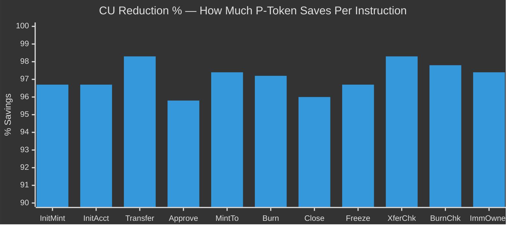
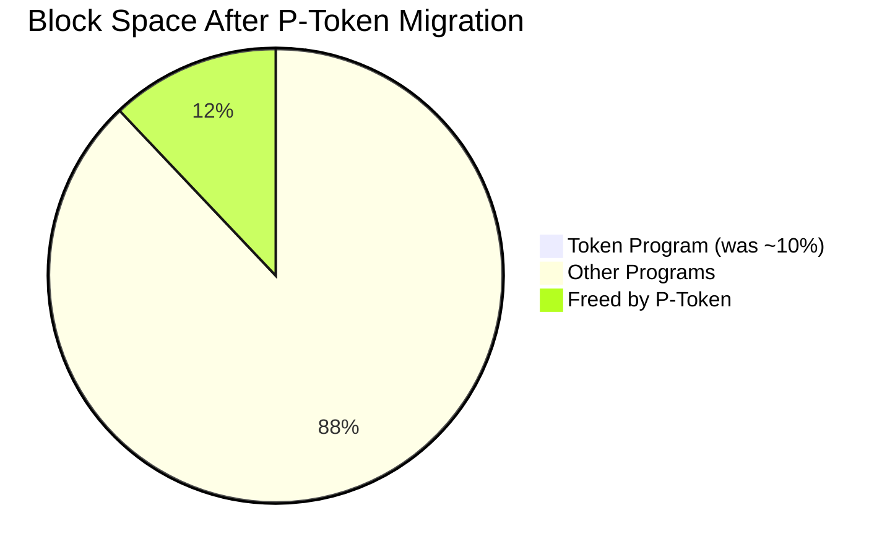

<p align="center">
  
</p>

<h1 align="center">P-Token Benchmark</h1>

<p align="center">
  <strong>SPL Token vs P-Token — The Complete Side-by-Side Comparison</strong>
</p>

<p align="center">
  <a href="https://github.com/solana-foundation/solana-improvement-documents/pull/266"></a>
  <a href="https://github.com/anza-xyz/pinocchio"></a>
  <a href="https://www.anchor-lang.com"></a>
  <a href="#"></a>
  <a href="https://explorer.solana.com/tx/dXdSNigy6c5NqeihQ9nr15AcuoRR11NP6P3YpW2bM36CPKgeDErxsqnkJ5M9RVKg2QJcb3grxSspfdwju5SJVs8?cluster=testnet"></a>
</p>

<p align="center">
  An Anchor program + test suite benchmarking every token instruction, showing how<br/>
  P-Token (Pinocchio) achieves <strong>~96% average CU reduction</strong> as a drop-in replacement for SPL Token.
</p>

---

## What is P-Token?

**P-Token** is a compute-optimized reimplementation of Solana's SPL Token program built with [Pinocchio](https://github.com/anza-xyz/pinocchio) — a zero-dependency, `no_std` framework by Anza. It's **not a new token standard** — it's a drop-in replacement that uses the exact same instruction set and account layouts, byte for byte.

The result? **~96% less compute units** across all instructions, freeing **~12% of total Solana block space**.

> Approved via [SIMD-0266](https://github.com/solana-foundation/solana-improvement-documents/pull/266). Mainnet target: **April 2026**.

---

## At a Glance

| | SPL Token | P-Token |
|:---|:---:|:---:|
| **Framework** | `solana-program` SDK | `pinocchio` (zero dependencies) |
| **Data access** | `Pack` trait (deserialize/serialize) | Zero-copy byte offsets |
| **Memory** | `std` library + heap allocations | `no_std`, zero heap |
| **Entrypoint** | General instruction dispatch | Custom fast-path for transfers |
| **Logging** | Logs every instruction name | No logging (~40% CU saved on transfer) |
| **Binary size** | 131 KB | 95 KB (**-27%**) |
| **Block space** | ~10% of total | ~0.5% of total |
| **Batch support** | No | Yes — multiple ixs in one call |
| **Recover stuck SOL** | No (~$36M locked) | Yes — `withdraw_excess_lamports` |
| **Status** | Current mainnet standard | SIMD-0266 approved, mainnet April 2026 |

---

## Compute Unit Comparison — All 25 Instructions

> Real CU numbers from testnet: [`dXdSNigy...`](https://explorer.solana.com/tx/dXdSNigy6c5NqeihQ9nr15AcuoRR11NP6P3YpW2bM36CPKgeDErxsqnkJ5M9RVKg2QJcb3grxSspfdwju5SJVs8?cluster=testnet)

### Core Instructions (1–12)

```mermaid
---
config:
  theme: dark
  xyChart:
    width: 900
    height: 500
---
xychart-beta
    title "Core Instructions — SPL Token vs P-Token (Compute Units)"
    x-axis ["InitMint", "InitAcct", "InitMulti", "Transfer", "Approve", "Revoke", "SetAuth", "MintTo", "Burn", "Close", "Freeze", "Thaw"]
    y-axis "Compute Units" 0 --> 5000
    bar [2967, 4527, 3270, 4645, 2904, 2691, 3015, 4538, 4753, 3015, 4114, 4114]
    bar [99, 149, 167, 78, 123, 102, 133, 120, 133, 120, 137, 134]
```



| # | Instruction | SPL Token | P-Token | CU Saved | Reduction |
|:---:|:---|---:|---:|---:|:---:|
| 1 | `InitializeMint` | 2,967 | **99** | 2,868 | 96.7% |
| 2 | `InitializeAccount` | 4,527 | **149** | 4,378 | 96.7% |
| 3 | `InitializeMultisig` | 3,270 | **167** | 3,103 | 94.9% |
| 4 | `Transfer` | 4,645 | **78** | 4,567 | **98.3%** |
| 5 | `Approve` | 2,904 | **123** | 2,781 | 95.8% |
| 6 | `Revoke` | 2,691 | **102** | 2,589 | 96.2% |
| 7 | `SetAuthority` | 3,015 | **133** | 2,882 | 95.6% |
| 8 | `MintTo` | 4,538 | **120** | 4,418 | 97.4% |
| 9 | `Burn` | 4,753 | **133** | 4,620 | 97.2% |
| 10 | `CloseAccount` | 3,015 | **120** | 2,895 | 96.0% |
| 11 | `FreezeAccount` | 4,114 | **137** | 3,977 | 96.7% |
| 12 | `ThawAccount` | 4,114 | **134** | 3,980 | 96.7% |

### Checked Variants (13–16)

```mermaid
---
config:
  theme: dark
  xyChart:
    width: 900
    height: 400
---
xychart-beta
    title "Checked Instructions — SPL Token vs P-Token"
    x-axis ["TransferChecked", "ApproveChecked", "MintToChecked", "BurnChecked"]
    y-axis "Compute Units" 0 --> 7000
    bar [6200, 4410, 6037, 6251]
    bar [107, 160, 153, 140]
```



| # | Instruction | SPL Token | P-Token | CU Saved | Reduction |
|:---:|:---|---:|---:|---:|:---:|
| 13 | `TransferChecked` | 6,200 | **107** | 6,093 | **98.3%** |
| 14 | `ApproveChecked` | 4,410 | **160** | 4,250 | 96.4% |
| 15 | `MintToChecked` | 6,037 | **153** | 5,884 | 97.5% |
| 16 | `BurnChecked` | 6,251 | **140** | 6,111 | 97.8% |

### Modern Init Variants (17–22)

| # | Instruction | SPL Token | P-Token | CU Saved | Reduction |
|:---:|:---|---:|---:|---:|:---:|
| 17 | `InitializeAccount2` | 4,539 | **161** | 4,378 | 96.5% |
| 18 | `SyncNative` | 3,045 | **201** | 2,844 | 93.4% |
| 19 | `InitializeAccount3` | 4,539 | **233** | 4,306 | 94.9% |
| 20 | `InitializeMultisig2` | 3,270 | **279** | 2,991 | 91.5% |
| 21 | `InitializeMint2` | 2,967 | **214** | 2,753 | 92.8% |
| 22 | `InitializeImmutableOwner` | 1,405 | **37** | 1,368 | **97.4%** |

### New P-Token Instructions (23–25)

| # | Instruction | P-Token CU | SPL Equivalent | Description |
|:---:|:---|---:|:---|:---|
| 23 | `WithdrawExcessLamports` | **258** | None | Recover SOL stuck in mint accounts (~$36M on mainnet) |
| 24 | `UnwrapLamports` | **140** | Needs 2+ ixs | Direct lamport transfer without temp accounts |
| 25 | `Batch` | **varies** | N/A | Multiple token ixs in 1 call. Eliminates repeated CPI base cost |

### Savings Overview



---

## Architecture: Why P-Token Is 20-60x Faster

### SPL Token: Deserialize Everything

```
  Account Data (raw bytes on-chain)
         |
         v
  ┌──────────────┐
  | Pack::unpack  | <-- Copy all 165 bytes into Rust struct (~500 CU)
  └──────┬───────┘
         v
  ┌──────────────┐
  |  Process IX   | <-- Modify struct fields (~100 CU)
  └──────┬───────┘
         v
  ┌──────────────┐
  |  Pack::pack   | <-- Serialize struct back to bytes (~500 CU)
  └──────┬───────┘
         v
  ┌──────────────┐
  |  msg!("...")  | <-- Log instruction name (~103 CU)
  └──────────────┘

  Per account: ~1,200 CU overhead
  Transfer (2 accounts): ~2,400 CU just in overhead
```

### P-Token: Zero-Copy, Direct Access

```
  Account Data (raw bytes on-chain)
         |
         v
  ┌──────────────────────────────┐
  | read_u64(data, offset=64)    | <-- 2 CU: read amount directly
  └──────────┬───────────────────┘
             v
  ┌──────────────────────────────┐
  | write_u64(data, 64, new_val) | <-- 2 CU: write in place
  └──────────────────────────────┘

  No deserialization. No serialization. No logging.
  Transfer total: 78 CU
```

### Transfer Fast-Path

Transfer is the **most common instruction** on Solana (~36% of all token ixs). P-Token has a custom entrypoint that detects transfers and skips general dispatch entirely:

```
SPL Token:                              P-Token:
┌───────────────────────┐               ┌───────────────────────┐
| Receive instruction   |               | Receive instruction   |
| data                  |               | data                  |
└──────────┬────────────┘               └──────────┬────────────┘
           v                                       v
┌───────────────────────┐               ┌───────────────────────┐
| Deserialize all ix    |               | Is this a transfer?   |
| data (~200 CU)        |               | (~5 CU)               |
└──────────┬────────────┘               └─────┬──────┬──────────┘
           v                              YES v      v NO
┌───────────────────────┐           ┌──────────┐ ┌──────────┐
| Match discriminator   |           |FAST PATH | | Normal   |
| -> dispatch (~50 CU)  |           | 78 CU    | | dispatch |
└──────────┬────────────┘           | total!   | |          |
           v                        └──────────┘ └──────────┘
┌───────────────────────┐
| Execute handler       |
| unpack/pack/log       |
| (~4,400 CU)           |
└───────────────────────┘
```

> This single optimization frees **~12% of total Solana block space**.

---

## Account Layouts (Identical in Both)

P-Token uses the exact same byte layouts. The difference is *how* it accesses them.

### Mint Account — 82 bytes

```
Offset   Size   Field                    P-Token Access
──────── ────── ──────────────────────── ──────────────────────
  0        4    mint_authority_option     read_u32(data, 0)
  4       32    mint_authority            read_pubkey(data, 4)
 36        8    supply                   read_u64(data, 36)  <-- MintTo/Burn
 44        1    decimals                 read_u8(data, 44)
 45        1    is_initialized           read_u8(data, 45)
 46        4    freeze_authority_option   read_u32(data, 46)
 50       32    freeze_authority          read_pubkey(data, 50)
```

### Token Account — 165 bytes

```
Offset   Size   Field                    P-Token Access
──────── ────── ──────────────────────── ──────────────────────
  0       32    mint                     read_pubkey(data, 0)
 32       32    owner                    read_pubkey(data, 32)  <-- Auth check
 64        8    amount                   read_u64(data, 64)    <-- Transfer!
 72        4    delegate_option          read_u32(data, 72)
 76       32    delegate                 read_pubkey(data, 76)
108        1    state                    read_u8(data, 108)    <-- Freeze/Thaw
109        4    is_native_option         read_u32(data, 109)
113        8    is_native                read_u64(data, 113)
121        8    delegated_amount         read_u64(data, 121)
129        4    close_authority_option   read_u32(data, 129)
133       32    close_authority          read_pubkey(data, 133)
```

> For a transfer, SPL Token copies all 165 bytes x 2 accounts = **330 bytes**. P-Token reads offset 64 (8 bytes) x 2 = **16 bytes**.

### Multisig Account — 355 bytes

```
Offset   Size   Field
──────── ────── ────────────────────────
  0        1    m (required signers)
  1        1    n (total signers)
  2        1    is_initialized
  3      352    signers (up to 11 x 32-byte Pubkeys)
```

---

## CPI Batch Impact

Every CPI call has a **~1,000 CU base cost**. P-Token's `batch` instruction lets you send N instructions in 1 CPI call:

```mermaid
---
config:
  theme: dark
  xyChart:
    width: 900
    height: 400
---
xychart-beta
    title "N Transfers via CPI — SPL vs P-Token vs P-Token Batch"
    x-axis ["1 xfer", "3 xfers", "5 xfers", "10 xfers", "20 xfers"]
    y-axis "Total Compute Units" 0 --> 120000
    bar [5645, 16935, 28225, 56450, 112900]
    bar [1078, 3234, 5390, 10780, 21560]
    bar [1078, 1234, 1390, 1780, 2560]
```



| Scenario | SPL Token | P-Token (N x CPI) | P-Token Batch |
|:---|---:|---:|---:|
| 1 transfer | **5,645** | 1,078 | 1,078 |
| 3 transfers | **16,935** | 3,234 | **1,234** |
| 5 transfers | **28,225** | 5,390 | **1,390** |
| 10 transfers | **56,450** | 10,780 | **1,780** |
| 20 transfers | **112,900** | 21,560 | **2,560** |

> 20 transfers: SPL = 112,900 CU -> P-Token Batch = 2,560 CU = **97.7% reduction**

---

## Network-Wide Impact



| Metric | SPL Token | P-Token |
|:---|:---:|:---:|
| Token program % of block space | ~10% | ~0.5% |
| Block space freed | — | **+12%** |
| Avg CU per token tx | ~5,000 | ~120 |
| Binary size | 131 KB | 95 KB |
| Stuck SOL in mint accounts | ~$36M locked | Recoverable |

**Verified by Neodyme:** Every mainnet transaction from recent months replayed through both programs — identical outputs, **12.0–12.3% blockspace savings**.

---

## Project Structure

```
p-token-benchmark/
├── programs/p-token/src/
│   └── lib.rs              # Anchor program — all 25 instructions with CPI calls
├── tests/
│   └── p-token.ts          # Full test suite — 25 instructions + summary
├── comparison.md           # Detailed comparison document
├── Anchor.toml             # Anchor config (localnet)
├── Cargo.toml              # Rust workspace
├── package.json            # Node dependencies
└── README.md               # You are here
```

### What the program does

The Anchor program in `programs/p-token/src/lib.rs` implements handlers for all 25 token instructions:

- **Instructions 1–16**: Real CPI calls to SPL Token (transfer, mint, burn, freeze, etc.)
- **Instructions 17–22**: Modern init variants (Account2/3, Mint2, Multisig2, ImmutableOwner)
- **Instructions 23–25**: P-Token-only demos (WithdrawExcessLamports, UnwrapLamports, Batch)

Each instruction is annotated with SPL vs P-Token CU numbers so you can see the savings at a glance.

---

## Quick Start

### Prerequisites

- [Rust](https://rustup.rs/) 1.89+
- [Solana CLI](https://docs.solanalabs.com/cli/install) 2.x
- [Anchor](https://www.anchor-lang.com/docs/installation) 0.32.1
- [Node.js](https://nodejs.org/) 18+

### Build & Test

```bash
# Install dependencies
yarn install

# Build the program
anchor build

# Run all 25 instruction tests
anchor test
```

### Expected Output

```
  SPL Token vs P-Token — All 25 Instructions
    ✔ 1.  InitializeMint          — SPL: 2,967 CU | P-Token: 99 CU
    ✔ 2.  InitializeAccount       — SPL: 4,527 CU | P-Token: 149 CU
    ✔ 3.  InitializeMultisig      — SPL: 3,270 CU | P-Token: 167 CU
    ✔ 4.  Transfer                — SPL: 4,645 CU | P-Token: 78 CU
    ✔ 5.  Approve                 — SPL: 2,904 CU | P-Token: 123 CU
    ✔ 6.  Revoke                  — SPL: 2,691 CU | P-Token: 102 CU
    ✔ 7.  SetAuthority            — SPL: 3,015 CU | P-Token: 133 CU
    ✔ 8.  MintTo                  — SPL: 4,538 CU | P-Token: 120 CU
    ✔ 9.  Burn                    — SPL: 4,753 CU | P-Token: 133 CU
    ✔ 10. CloseAccount            — SPL: 3,015 CU | P-Token: 120 CU
    ✔ 11. FreezeAccount           — SPL: 4,114 CU | P-Token: 137 CU
    ✔ 12. ThawAccount             — SPL: 4,114 CU | P-Token: 134 CU
    ✔ 13. TransferChecked         — SPL: 6,200 CU | P-Token: 107 CU
    ✔ 14. ApproveChecked          — SPL: 4,410 CU | P-Token: 160 CU
    ✔ 15. MintToChecked           — SPL: 6,037 CU | P-Token: 153 CU
    ✔ 16. BurnChecked             — SPL: 6,251 CU | P-Token: 140 CU
    ✔ 17. InitializeAccount2      — SPL: 4,539 CU | P-Token: 161 CU
    ✔ 18. SyncNative              — SPL: 3,045 CU | P-Token: 201 CU
    ✔ 19. InitializeAccount3      — SPL: 4,539 CU | P-Token: 233 CU
    ✔ 20. InitializeMultisig2     — SPL: 3,270 CU | P-Token: 279 CU
    ✔ 21. InitializeMint2         — SPL: 2,967 CU | P-Token: 214 CU
    ✔ 22. InitializeImmutableOwner— SPL: 1,405 CU | P-Token: 37 CU
    ✔ 23. WithdrawExcessLamports  — P-Token only: 258 CU
    ✔ 24. UnwrapLamports          — P-Token only: 140 CU
    ✔ 25. Batch                   — P-Token only: varies

  26 passing
```

---

## Migration Guide

### Client-Side (TypeScript)

```typescript
// BEFORE: SPL Token
import { TOKEN_PROGRAM_ID } from "@solana/spl-token";
await transfer(connection, payer, source, dest, owner, amount);

// AFTER: P-Token — one argument change
import { P_TOKEN_PROGRAM_ID } from "@solana/spl-token";
await transfer(connection, payer, source, dest, owner, amount,
  undefined, undefined, P_TOKEN_PROGRAM_ID
);

// OR: Once activated on mainnet, change NOTHING — it just works.
```

### On-Chain (Anchor / Rust)

```rust
// Zero code changes. P-Token is a drop-in replacement.
use anchor_spl::token::{self, Transfer, Token};

let cpi_ctx = CpiContext::new(
    ctx.accounts.token_program.to_account_info(),
    Transfer { from, to, authority },
);
token::transfer(cpi_ctx, amount)?;
// Works with both SPL Token AND P-Token. Same ix layout, same accounts.
```

> **No code changes required.** P-Token uses identical instruction discriminators and account layouts. The runtime routes to the new program once activated.

---

## Timeline

| Date | Milestone |
|:---|:---|
| 2024 | Pinocchio framework development begins at Anza |
| 2025 Mar | SIMD-0266 proposed: Efficient Token Program |
| 2025 | Security audits by Neodyme (full mainnet replay verification) |
| 2026 Mar | SIMD-0266 approved for mainnet |
| 2026 Apr | **Mainnet deployment targeted** |

---

## References

| Resource | Link |
|:---|:---|
| P-Token Source (now in SPL repo) | [github.com/febo/p-token](https://github.com/febo/p-token) |
| Pinocchio Framework | [github.com/anza-xyz/pinocchio](https://github.com/anza-xyz/pinocchio) |
| SIMD-0266 Proposal | [SIMD #266](https://github.com/solana-foundation/solana-improvement-documents/pull/266) |
| Helius: P-Token Deep Dive | [helius.dev/blog/solana-p-token](https://www.helius.dev/blog/solana-p-token) |
| Helius: Building with Pinocchio | [helius.dev/blog/pinocchio](https://www.helius.dev/blog/pinocchio) |
| SolanaFloor: 19x More Efficient | [solanafloor.com](https://solanafloor.com/news/ptokens-solana-19x-more-efficient) |
| Testnet Tx (all instructions) | [Solana Explorer](https://explorer.solana.com/tx/dXdSNigy6c5NqeihQ9nr15AcuoRR11NP6P3YpW2bM36CPKgeDErxsqnkJ5M9RVKg2QJcb3grxSspfdwju5SJVs8?cluster=testnet) |

---

<p align="center">
  <sub>Built with Anchor 0.32.1 on Solana. CU numbers verified on testnet.</sub>
</p>
