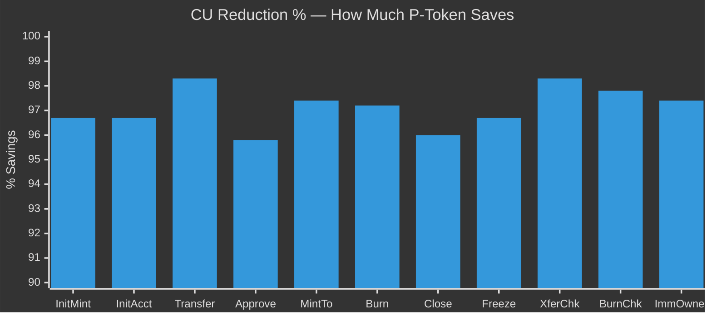
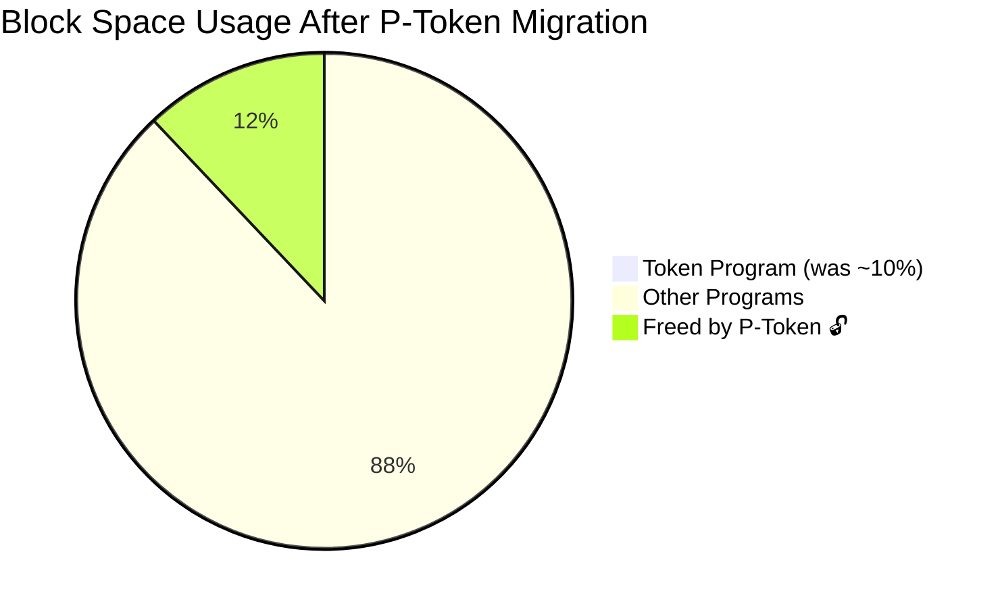

<p align="center">
  <h1 align="center">⚡ SPL Token vs P-Token</h1>
  <p align="center">
    <strong>The Definitive Comparison</strong><br/>
    Pinocchio-powered, compute-optimized drop-in replacement for Solana's SPL Token Program
  </p>
  <p align="center">
    <a href="https://github.com/solana-foundation/solana-improvement-documents/pull/266">SIMD-0266</a> ·
    <a href="https://github.com/anza-xyz/pinocchio">Pinocchio</a> ·
    <a href="https://www.helius.dev/blog/solana-p-token">Deep Dive</a>
  </p>
</p>

---

## 🔥 At a Glance

| | SPL Token | P-Token |
|:---|:---:|:---:|
| **Framework** | `solana-program` SDK | `pinocchio` (zero dependencies) |
| **Data access** | `Pack` trait (deserialize/serialize) | Zero-copy byte offsets |
| **Memory** | `std` library + heap allocations | `no_std`, zero heap |
| **Entrypoint** | General instruction dispatch | Custom fast-path for transfers |
| **Logging** | Logs every instruction name | No logging (~40% CU saved on transfer) |
| **Binary size** | 131 KB | 95 KB (**-27%**) |
| **Block space usage** | ~10% of total | ~0.5% of total |
| **Batch support** | ❌ | ✅ Multiple ixs in one call |
| **Recover stuck SOL** | ❌ ~$36M locked forever | ✅ `withdraw_excess_lamports` |
| **Status** | Current mainnet standard | Approved via SIMD-0266, mainnet April 2026 |

---

## 📈 Visual Comparison

### Compute Units Per Instruction

```mermaid
---
config:
  theme: dark
  xyChart:
    width: 900
    height: 500
---
xychart-beta
    title "SPL Token vs P-Token — Compute Units (log scale feel)"
    x-axis ["InitMint", "InitAcct", "InitMulti", "Transfer", "Approve", "Revoke", "SetAuth", "MintTo", "Burn", "Close", "Freeze", "Thaw"]
    y-axis "Compute Units" 0 --> 5000
    bar [2967, 4527, 3270, 4645, 2904, 2691, 3015, 4538, 4753, 3015, 4114, 4114]
    bar [99, 149, 167, 78, 123, 102, 133, 120, 133, 120, 137, 134]
```



### Checked Variants — CU Comparison

```mermaid
---
config:
  theme: dark
  xyChart:
    width: 900
    height: 400
---
xychart-beta
    title "Checked Instructions — SPL Token vs P-Token"
    x-axis ["TransferChecked", "ApproveChecked", "MintToChecked", "BurnChecked"]
    y-axis "Compute Units" 0 --> 7000
    bar [6200, 4410, 6037, 6251]
    bar [107, 160, 153, 140]
```



### Percentage Savings Per Instruction



### CPI Batch Impact (DeFi Scenario)

```mermaid
---
config:
  theme: dark
  xyChart:
    width: 900
    height: 400
---
xychart-beta
    title "N Transfers via CPI — SPL vs P-Token vs P-Token Batch"
    x-axis ["1 transfer", "3 transfers", "5 transfers", "10 transfers", "20 transfers"]
    y-axis "Total Compute Units" 0 --> 120000
    bar [5645, 16935, 28225, 56450, 112900]
    bar [1078, 3234, 5390, 10780, 21560]
    bar [1078, 1234, 1390, 1780, 2560]
```



### Network Block Space Impact



---

## 📊 Complete CU Comparison — All 25 Instructions

> Real numbers from testnet: [`dXdSNigy...`](https://explorer.solana.com/tx/dXdSNigy6c5NqeihQ9nr15AcuoRR11NP6P3YpW2bM36CPKgeDErxsqnkJ5M9RVKg2QJcb3grxSspfdwju5SJVs8?cluster=testnet)

### Core Instructions (1–12)

| # | Instruction | SPL Token | P-Token | CU Saved | Reduction |
|:---:|:---|---:|---:|---:|:---:|
| 1 | `InitializeMint` | 2,967 | **99** | 2,868 | 🟢 96.7% |
| 2 | `InitializeAccount` | 4,527 | **149** | 4,378 | 🟢 96.7% |
| 3 | `InitializeMultisig` | 3,270 | **167** | 3,103 | 🟢 94.9% |
| 4 | `Transfer` | 4,645 | **78** | 4,567 | 🔴 **98.3%** |
| 5 | `Approve` | 2,904 | **123** | 2,781 | 🟢 95.8% |
| 6 | `Revoke` | 2,691 | **102** | 2,589 | 🟢 96.2% |
| 7 | `SetAuthority` | 3,015 | **133** | 2,882 | 🟢 95.6% |
| 8 | `MintTo` | 4,538 | **120** | 4,418 | 🟢 97.4% |
| 9 | `Burn` | 4,753 | **133** | 4,620 | 🟢 97.2% |
| 10 | `CloseAccount` | 3,015 | **120** | 2,895 | 🟢 96.0% |
| 11 | `FreezeAccount` | 4,114 | **137** | 3,977 | 🟢 96.7% |
| 12 | `ThawAccount` | 4,114 | **134** | 3,980 | 🟢 96.7% |

### Checked Variants (13–16)

| # | Instruction | SPL Token | P-Token | CU Saved | Reduction |
|:---:|:---|---:|---:|---:|:---:|
| 13 | `TransferChecked` | 6,200 | **107** | 6,093 | 🔴 **98.3%** |
| 14 | `ApproveChecked` | 4,410 | **160** | 4,250 | 🟢 96.4% |
| 15 | `MintToChecked` | 6,037 | **153** | 5,884 | 🟢 97.5% |
| 16 | `BurnChecked` | 6,251 | **140** | 6,111 | 🟢 97.8% |

### Modern Init Variants (17–22)

| # | Instruction | SPL Token | P-Token | CU Saved | Reduction |
|:---:|:---|---:|---:|---:|:---:|
| 17 | `InitializeAccount2` | 4,539 | **161** | 4,378 | 🟢 96.5% |
| 18 | `SyncNative` | 3,045 | **201** | 2,844 | 🟢 93.4% |
| 19 | `InitializeAccount3` | 4,539 | **233** | 4,306 | 🟢 94.9% |
| 20 | `InitializeMultisig2` | 3,270 | **279** | 2,991 | 🟢 91.5% |
| 21 | `InitializeMint2` | 2,967 | **214** | 2,753 | 🟢 92.8% |
| 22 | `InitializeImmutableOwner` | 1,405 | **37** | 1,368 | 🔴 **97.4%** |

### 🆕 New P-Token Instructions (23–25)

| # | Instruction | P-Token CU | SPL Equivalent | Description |
|:---:|:---|---:|:---|:---|
| 23 | `WithdrawExcessLamports` | **258** | ❌ None (SOL stuck forever) | Recover SOL accidentally sent to mint accounts. ~869K accounts hold ~$36M |
| 24 | `UnwrapLamports` | **140** | ❌ Needs 2+ instructions | Direct lamport transfer from wrapped SOL without temp accounts |
| 25 | `Batch` | **varies** | ❌ Separate CPI per instruction | Execute N token instructions in 1 call. Eliminates repeated 1,000 CU CPI base cost |

---

## 🏗️ Architecture Deep Dive

### Why Is SPL Token So Expensive?

```
SPL Token uses Rust's Pack trait for every operation:

  ┌─────────────────────────────────────────────────────┐
  │                SPL TOKEN FLOW                       │
  │                                                     │
  │  Account Data (raw bytes)                           │
  │         │                                           │
  │         ▼                                           │
  │  ┌──────────────┐                                   │
  │  │ Pack::unpack  │ ← Copy 165 bytes into struct     │
  │  │  (~500 CU)   │                                   │
  │  └──────┬───────┘                                   │
  │         ▼                                           │
  │  ┌──────────────┐                                   │
  │  │  Process IX   │ ← Modify struct fields            │
  │  │  (~100 CU)   │                                   │
  │  └──────┬───────┘                                   │
  │         ▼                                           │
  │  ┌──────────────┐                                   │
  │  │  Pack::pack   │ ← Copy struct back to bytes      │
  │  │  (~500 CU)   │                                   │
  │  └──────┬───────┘                                   │
  │         ▼                                           │
  │  ┌──────────────┐                                   │
  │  │  msg!("...")  │ ← Log instruction name            │
  │  │  (~103 CU)   │                                   │
  │  └──────────────┘                                   │
  │                                                     │
  │  Total per account: ~1,200 CU                       │
  │  Transfer touches 2 accounts: ~2,400 CU overhead    │
  └─────────────────────────────────────────────────────┘
```

### How P-Token Eliminates This

```
P-Token uses zero-copy byte-level access via Pinocchio:

  ┌─────────────────────────────────────────────────────┐
  │               P-TOKEN FLOW                          │
  │                                                     │
  │  Account Data (raw bytes)                           │
  │         │                                           │
  │         ▼                                           │
  │  ┌──────────────────────────────┐                   │
  │  │ read_u64(data, offset=64)   │ ← Read amount     │
  │  │          (~2 CU)            │   directly from    │
  │  └──────────┬──────────────────┘   byte offset.     │
  │             ▼                      No copy.         │
  │  ┌──────────────────────────────┐  No allocation.   │
  │  │ write_u64(data, 64, new_val)│ ← Write new       │
  │  │          (~2 CU)            │   value in place.  │
  │  └──────────────────────────────┘                   │
  │                                                     │
  │  No unpack. No pack. No logging.                    │
  │  Transfer total: ~78 CU                             │
  └─────────────────────────────────────────────────────┘
```

### Transfer Fast-Path (Custom Entrypoint)

```
Standard Entrypoint (SPL Token):           P-Token Custom Entrypoint:
┌──────────────────────┐                   ┌──────────────────────┐
│ Receive instruction  │                   │ Receive instruction  │
│ data                 │                   │ data                 │
└──────────┬───────────┘                   └──────────┬───────────┘
           ▼                                          ▼
┌──────────────────────┐                   ┌──────────────────────┐
│ Deserialize all      │                   │ Check: is this a     │
│ instruction data     │                   │ transfer?            │
│ (~200 CU)            │                   │ (~5 CU)              │
└──────────┬───────────┘                   └─────┬──────┬─────────┘
           ▼                                YES  ▼      ▼  NO
┌──────────────────────┐               ┌──────────┐ ┌──────────┐
│ Match discriminator  │               │FAST PATH │ │ Normal   │
│ → dispatch to handler│               │ 78 CU    │ │ dispatch │
│ (~50 CU)             │               │ total!   │ │          │
└──────────┬───────────┘               └──────────┘ └──────────┘
           ▼
┌──────────────────────┐
│ Execute handler      │
│ (unpack/pack/log)    │
│ (~4,400 CU)          │
└──────────────────────┘

Transfer = ~36% of all token ixs on Solana.
The fast-path alone frees ~12% of total block space.
```

---

## 🗂️ Account Layouts (Identical in Both)

### Mint Account — 82 bytes

```
Offset   Size   Field                    P-Token Access
──────── ────── ──────────────────────── ──────────────────────
  0        4    mint_authority_option     read_u32(data, 0)
  4       32    mint_authority            read_pubkey(data, 4)
 36        8    supply                   read_u64(data, 36)  ◄── MintTo/Burn
 44        1    decimals                 read_u8(data, 44)
 45        1    is_initialized           read_u8(data, 45)
 46        4    freeze_authority_option   read_u32(data, 46)
 50       32    freeze_authority          read_pubkey(data, 50)
```

### Token Account — 165 bytes

```
Offset   Size   Field                    P-Token Access
──────── ────── ──────────────────────── ──────────────────────
  0       32    mint                     read_pubkey(data, 0)
 32       32    owner                    read_pubkey(data, 32)  ◄── Auth check
 64        8    amount                   read_u64(data, 64)    ◄── Transfer!!
 72        4    delegate_option          read_u32(data, 72)
 76       32    delegate                 read_pubkey(data, 76)
108        1    state                    read_u8(data, 108)    ◄── Freeze/Thaw
109        4    is_native_option         read_u32(data, 109)
113        8    is_native                read_u64(data, 113)
121        8    delegated_amount         read_u64(data, 121)
129        4    close_authority_option   read_u32(data, 129)
133       32    close_authority          read_pubkey(data, 133)
```

> **Key insight:** For a transfer, SPL Token deserializes all 165 bytes × 2 accounts = 330 bytes of copying. P-Token only touches offset 64 (8 bytes) × 2 accounts = 16 bytes.

### Multisig Account — 355 bytes

```
Offset   Size   Field
──────── ────── ────────────────────────
  0        1    m (required signers)
  1        1    n (total signers)
  2        1    is_initialized
  3      352    signers (up to 11 × 32 byte Pubkeys)
```

---

## 🔁 CPI Cost Impact (Program-to-Program)

Every CPI call to a token program has a **~1,000 CU base cost**. The savings come from execution inside:

### Single Operations

| Operation | SPL Token | P-Token | Savings |
|:---|---:|---:|---:|
| 1 transfer via CPI | 1,000 + 4,645 = **5,645** | 1,000 + 78 = **1,078** | 4,567 CU |
| 1 mint via CPI | 1,000 + 4,538 = **5,538** | 1,000 + 120 = **1,120** | 4,418 CU |
| 1 burn via CPI | 1,000 + 4,753 = **5,753** | 1,000 + 133 = **1,133** | 4,620 CU |

### Batch Operations (DeFi Game-Changer)

| Scenario | SPL Token (N × CPI) | P-Token (N × CPI) | P-Token Batch (1 CPI) |
|:---|---:|---:|---:|
| 3 transfers | **16,935** CU | 3,234 CU | **1,234** CU |
| 5 transfers | **28,225** CU | 5,390 CU | **1,390** CU |
| 10 transfers | **56,450** CU | 10,780 CU | **1,780** CU |
| 20 transfers | **112,900** CU | 21,560 CU | **2,560** CU |

> **20 transfers:** SPL = 112,900 CU → P-Token Batch = 2,560 CU = **97.7% reduction** 🤯

---

## 🌐 Network-Wide Impact

| Metric | SPL Token (Current) | P-Token (After Migration) |
|:---|:---:|:---:|
| Token program share of block space | ~10% | ~0.5% |
| Block space freed for users | — | **+12%** |
| Average CU per token transaction | ~5,000 CU | ~120 CU |
| Binary size on-chain | 131 KB | 95 KB |
| Stuck SOL in mint accounts | ~$36M 🔒 | Recoverable ✅ |

**Verification:** Neodyme replayed every mainnet transaction from recent months through both programs — **identical outputs** confirmed, with **12.0–12.3% total blockspace savings** measured.

---

## 🔄 Migration Guide

### For Client Code (TypeScript)

```typescript
// ❌ BEFORE: SPL Token
import { TOKEN_PROGRAM_ID } from "@solana/spl-token";
await transfer(connection, payer, source, dest, owner, amount);

// ✅ AFTER: P-Token — change ONE argument
import { P_TOKEN_PROGRAM_ID } from "@solana/spl-token";
await transfer(connection, payer, source, dest, owner, amount,
  undefined, undefined, P_TOKEN_PROGRAM_ID
);

// ✅ OR: When the runtime activates P-Token as default, change NOTHING
```

### For On-Chain Programs (Anchor/Rust)

```rust
// The code is IDENTICAL. P-Token is a drop-in replacement.
// Anchor's Program<'info, Token> will resolve to whichever
// token program ID is passed in the transaction.

use anchor_spl::token::{self, Transfer, Token};

let cpi_ctx = CpiContext::new(
    ctx.accounts.token_program.to_account_info(),
    Transfer { from, to, authority },
);
token::transfer(cpi_ctx, amount)?;
// Works with both SPL Token AND P-Token — zero code changes.
```

### Key Point

> **No code changes required for existing programs.**
> P-Token uses identical instruction discriminators and account layouts.
> The Solana runtime routes to the new program once activated via SIMD-0266.

---

## 📅 Timeline

| Date | Milestone |
|:---|:---|
| 2024 | Pinocchio framework development begins at Anza |
| 2025 Mar | SIMD-0266 proposed: Efficient Token Program |
| 2025 | Security audits by Neodyme (full mainnet replay verification) |
| 2026 Mar | SIMD-0266 approved for mainnet ✅ |
| 2026 Apr | **Mainnet deployment targeted** 🚀 |

---

## 📚 References

| Resource | Link |
|:---|:---|
| P-Token Source (archived, now in SPL) | [github.com/febo/p-token](https://github.com/febo/p-token) |
| Pinocchio Framework | [github.com/anza-xyz/pinocchio](https://github.com/anza-xyz/pinocchio) |
| SIMD-0266 Proposal | [solana-foundation/SIMD#266](https://github.com/solana-foundation/solana-improvement-documents/pull/266) |
| Helius: P-Token Deep Dive | [helius.dev/blog/solana-p-token](https://www.helius.dev/blog/solana-p-token) |
| Helius: Building with Pinocchio | [helius.dev/blog/pinocchio](https://www.helius.dev/blog/pinocchio) |
| SolanaFloor: 19x More Efficient | [solanafloor.com](https://solanafloor.com/news/ptokens-solana-19x-more-efficient) |
| Testnet Transaction (all ixs) | [explorer.solana.com](https://explorer.solana.com/tx/dXdSNigy6c5NqeihQ9nr15AcuoRR11NP6P3YpW2bM36CPKgeDErxsqnkJ5M9RVKg2QJcb3grxSspfdwju5SJVs8?cluster=testnet) |
